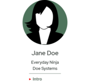
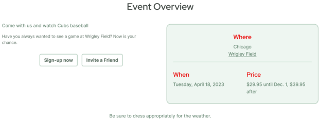
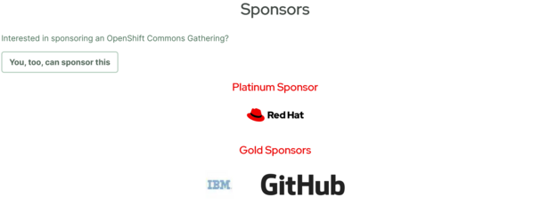
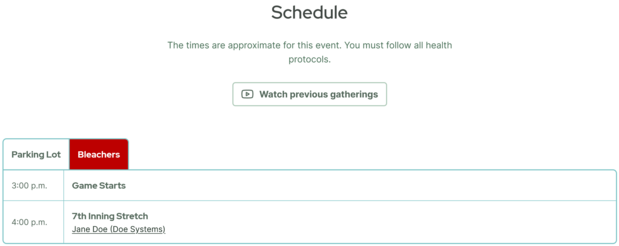

# Contributing

If you wish to contribute to this repository please follow the guidelines below.

## Prerequisites

Your system needs to have the following installed to be able to build this website:

- [Node.js](https://nodejs.org/)
- [git](https://git-scm.com/)
- [yarn](https://www.npmjs.com/package/yarn)
- [gatsby-cli](https://www.npmjs.com/package/gatsby-cli)
- [ruby](https://www.ruby-lang.org/en/) (only if you need to update the YouTube video list)

## Cloning the repository

1. [Fork this repository](https://github.com/openshift/commons.openshift.org/fork) into your own GitHub account.
1. Clone the site to your local machine:
   `git clone git@github.com:your-username/commons.openshift.org.git`.
1. Add the upstream remote to follow this repository's changes:
   `git remote add upstream git@github.com:openshift/commons.openshift.org.git`
   `git fetch upstream`

## Building the site locally

1. Run `yarn` to install all of the required packages.
1. Run `yarn run dev` to build and run a development server.

If the site builds successfully, you can access it at [http://localhost:8000](http://localhost:8000).

To clear cache files, run `gatsby clean`. This is sometimes needed to ensure a clean build.

## Updating the site

### Participants

#### Automatic method

Currently the most common task is to add members' information to the website, i.e.,
their logo, name, and URL. You can check if any there's any logo waiting to be added
on this repository's [issues](https://github.com/openshift-cs/commons.openshift.org/issues).

A script in the repository automates the addition of partners to OpenShift Commons. To use the script to add a partner, add an Issue where the body is in the following format:

```
Company: Company name
URL: URL of company's website
Logo: URL of the company's logo (.svg, .jpg, .png, etc. with SVG the preferred format)
```

Capitalization of the fields does not matter, however each need to be on different lines, spelled correctly, and be followed with `:`. A "TBD" can act as a placeholder for any of the three fields. The program will simply skip the issue entirely until the TBD is revised.

#### Manual method

The participants (displayed on [OpenShift Commons Participants](https://commons.openshift.org/participants/) are in the `src/content/participants` directory.

Place the company's logo image in this directory. Edit `participants.yml` and add the new participant.

Example entry:

```
- name: 'Red Hat'
  link: 'https://cloud.redhat.com'
  logo: 'red-hat-logo.svg'
```

Displays as:


The fields are:

- **name** — the participant name.
- **link** — URL to the participant.
- **logo** — image file name. Note: SVG is the preferred format.

### Operators

The operators (displayed on [Community-created Operators](https://commons.openshift.org/sigs/operators/) are in the `src/content/operators` directory.

Place the company's logo image in this directory. Edit `operators.yml` and add the new operator.

Example entry:

```
- title: 'Syndesis'
  link: 'https://syndesis.io/'
  src_link: 'https://github.com/syndesisio/syndesis/tree/master/install/operator'
  logo: 'syndesis.png'
  description: 'The Syndesis Infrastructure Operator for installing and updating Syndesis.'
```

Displays as:


The fields are:

- **title** — the operator title.
- **link** — URL to the operator information page.
- **src_link** — URL to the operator source code. If not available, use your best judgement. Worst case, use the same URL as **link**.
- **logo** — image file name. Note: SVG is the preferred format.
- **description** — A short description of the operator.

### Speakers

Speaker details are referenced by `id` in the schedule section of a gathering file. The speakers are in the `src/content/speakers` directory.

Place the speakers image in this directory (optional). Edit `speakers.yml` and add the new speaker.

**N.B.: the `id` of a speaker in a gathering file must match the `speaker_id` in this file for the information to be found.**

Example entry:

```
- speaker_id: 'jane-doe'
  name: 'Jane Doe'
  role: 'Everyday Ninja'
  url: 'https://doesystems.com/jane/'
  company: 'Doe Systems'
  photo: 'janedoe.jpg'
  intro: 'Jane is...'
```

Displays as:



The fields are:

- **speaker_id** — a unique ID for this speaker. It will be referenced from a gathering file.
- **name** — The speaker's name.
- **role** — Role or job title.
- **company** — Company name (optional).
- **url** — URL to company or speaker information page (optional).
- **photo** — image file name (optional).
- **intro** — a short introduction to the speaker (optional).

### Sponsors

Sponsor information is referenced from the gatherings file. It first looks for a sponsor in the participants directory, then in `src/content/sponsors` directory.

To add a sponsor (who is not a participant), place the sponsor's logo image in this directory. Edit `sponsors.yml` and add the new sponsor.

Example entry:

```
- name: 'Red Hat'
  link: 'https://cloud.redhat.com'
  logo: 'red-hat-logo.svg'
```

The fields are:

- **name** — the sponsor name.
- **link** — URL to the sponsor.
- **logo** — image file name. Note: SVG is the preferred format.

### Static files

Images or presentation files that are to be on the website but not processed by Gatsby need to be placed under the `static` directory.

For example, to have the file `MyPresentation.pdf` available at https://commons.openshift.org/gatherings/slides/MyPresentation.pdf place the file in the `static/gatherings/slides` directory.

Note: for best results, do not use spaces in files names and limit punctuation to period, hyphen, or underscore (. - \_).

### Gatherings

Gatherings information is located under the `src/content/gatherings` directory. Each gathering is in a separate subdirectory. The name of the subdirectory will become the of the URL.

For example, to create a gathering for Chicago on April 18, 2023, create the directory `chicago-23-apr-18`. In that directory create the file `index.mdx`. This file will contain YAML frontmatter with all of the information. The URL for this gathering would be `https://commons.openshift.org/gatherings/chicago-23-apr-18`.

Since this file contains many fields, the information will be presented a section at a time.

#### Basic information

Example:

```
---
title: Chicago Meeting
description: Come join us in Chicago at Wrigley Field.
date: '2023-04-18'
time: '2:30–6 p.m. CDT'
location: Chicago
---
```

Displays on the gatherings summary page as:


and at the top of the gathering page as:


The fields are:

- **title** — title of the gathering.
- **description** — description that displays in the summary (optional).
- **date** — date in YYYY-MM-DD format.
- **time** — time of the gathering

#### Language specification

The `language` field is used to format the date according to a particular language.

Examples:

```
language: 'en-US'
```

Displays as:


```
language: 'en-UK'
```

Displays as:


```
language: 'pt-BR'
```

Displays as:


The filed is:

- **language** — the language used to format the date. Must be a standard [HTML language specifier](https://developer.mozilla.org/en-US/docs/Web/HTML/Global_attributes/lang). Defaults to `en-US` (optional).

#### Introduction

Introduction section example:

```
head_text: >-
  Come join us for a baseball outing and a day of fun.
registration_text: Sign-up now
registration_URL: 'https://example.com/'
registration_text2: Buy tickets
registration_URL2: 'https://example.com/'
registration_text3: Reserve hotel
registration_URL3: 'https://example.com/'
sponsoring_text: You, too, can sponsor this
sponsoring_URL: 'mailto:someone@example.com'
```

Displays as:


The fields are:

- **head_text** — the intro text for the gathering (optional). If not specified, displays as: `Where users, partners, customers, contributors and upstream project leads come together to collaborate and work together across the OpenShift Cloud Native ecosystem.`
- **registration_text** — text for the registration button.
- **registration_URL** — link for the registration button.
- **registration_text2** — text for the second registration button (optional).
- **registration_URL2** — link for the second registration button (optional).
- **registration_text3** — text for the third registration button (optional).
- **registration_URL3** — link for the third registration button (optional).
- **sponsoring_text** — text for the sponsoring button (optional). If `sponsoring_URL` is specified but no text, the default is `Apply to be a Sponsor`.
- **sponsoring_URL** — link for the sponsoring button.

#### Event overview

Event overview section example:

```
lead_text: Come with us and watch Cubs baseball
info_text: >-
  Have you always wanted to see a game at Wrigley Field? Now is your chance.
invite_link: 'https://example.com/'
venue: Wrigley Field
venue_URL: 'https://www.mlb.com/cubs/ballpark'
price: $29.95 until Dec. 1, $39.95 after
event_footer_text: Be sure to dress appropriately for the weather.
```

Displays as:



The fields are:

- **lead_text** — lede text of the overview.
- **info_text** — information paragraph.
- **invite_link** — invite a friend link (optional).
- **venue** — venue name.
- **venue_URL** — link to venue (optional).
- **price** — price information.
- **event_footer** — overview footer paragraph.

#### Sponsors

Sponsor section example:

```
sponsors:
  - name: Red Hat
    level: 1
    label: Platinum Sponsor
  - name: IBM
    level: 2
  - name: Github
    level: 2
    label: Gold Sponsors
```

Displays as:



Sponsor section without levels example:

```
sponsors:
  - name: Red Hat
  - name: IBM
  - name: Github
```

Displays as:


The fields are:

- **sponsors** — the section label (section is optional).
- **name** — the name must match either an entry in participants or sponsors.
- **level** — numeric level for the display hierarchy (optional; default is all sponsors display at the same level).
- **label** — title text for sponsor level. Use plural form if there are multiple sponsors in the same group. Only read from the last sponsor at a particular level (optional).

#### Schedule

Schedule section example:

```
schedule_leadin: The times are approximate for this event. You must follow all health protocols.
videos_text: Watch previous gatherings
schedule:
  - local_time: '2:30 p.m.'
    session_name: 'Gates Open'
    track: Parking Lot
  - local_time: '3:00 p.m.'
    session_name: 'Game Starts'
    track: Bleachers
  - local_time: '4:00 p.m.'
    session_name: '7th Inning Stretch'
    speakers:
      - id: 'jane-doe'
    track: Bleachers
```

Displays as:



The fields are:

- **schedule_leadin** — opening paragraph (optional). The default text is `Code of Conduct: We follow the Code of Conduct of other events such as KubeCon. Similarly we are dedicated to providing a harassment-free experience for participants at all of our events, whether they are held in person or virtually. All event participants, whether they are attending an in-person event or a virtual event, are expected to behave in accordance with professional standards, with both this Code of Conduct as well as their respective employer's policies governing appropriate workplace behavior and applicable laws.`.
- **videos_text**: button text for link to YouTube gatherings playlists (optional). Defaults to `See sessions from previous gatherings`.
- **schedule**: section label (section is optional).
- **local_time**: start time of session.
- **session_name**: — session title.
- **track**: — track name (optional). If no sessions have a track, sessions display without tab interface. Sessions in the same track display in that tab. If tracks are defined, an event without one displays on all tracks. This is useful for breaks, reception, lunch, etc.
- **speakers** — section label for session speakers (section is optional).
- **id** — ID of a speaker from `src/content/speakers/speakers.yml`.

#### Speakers

If speakers are specified in the schedule and an entry is found in `src/content/speakers/speakers.yml` that matches, they will be displayed.

Displays as:


#### Venue

Venue section example:

```
venue_address: 1060 W. Addison St.
google_maps_URL: '<iframe src="https://www.google.com/maps/embed?pb=!1m18!1m12!1m3!1d2967.413977857587!2d-87.65752674858008!3d41.94844236888554!2m3!1f0!2f0!3f0!3m2!1i1024!2i768!4f13.1!3m3!1m2!1s0x880fd3b2e59adf21%3A0x1cea3ee176ddd646!2sWrigley%20Field!5e0!3m2!1sen!2sus!4v1654913073280!5m2!1sen!2sus" width="600" height="450" style="border:0;" allowfullscreen="" loading="lazy" referrerpolicy="no-referrer-when-downgrade"></iframe>'
```

Displays as:

The fields are:


The fields are:

- **venue_address** — address of the venue (optional).
- **google_maps_URL** — the URL of a Google map to the venue. On Google, select Share, Embed a map, then copy the code (it should start with `<iframe...`) (optional).

Note: the other fields displayed in this section (`date`, `time`, `venue`, `venue_URL`, and `location`) already defined above.

#### Translations

If the gathering is being held in another language, the headings can be translated.

Translation example:

```
translate_overview: Descrição do evento
translate_invite: Convidar um amigo
translate_where: Onde
translate_when: Quando
translate_price: Custo
translate_sponsors: Patrocinadores
translate_schedule: Agenda
translate_speakers: Palestrantes
translate_venue: Local do evento
```

The fields are:

- **translate_overview** — translation of `Event Overview`.
- **translate_invite** — translation of `Invite a Friend`.
- **translate_where** — translation of `Where`.
- **translate_when** — translation of `When`.
- **translate_price** — translation of `Price`.
- **translate_sponsors** — translation of `Sponsors`.
- **translate_schedule** — translation of `Schedule`.
- **translate_speakers** — translation of `Speakers`.
- **translate_venue** — translation of `Venue`.

#### Full example

Example of a full `index.mdx` file:

```
---
title: 'LATAM OpenShift Commons Gathering 2021 PT'
menu: 'show'
description: ''
language: 'pt-BR'
date: '2021-10-06'
time: '10 a.m–3 p.m.'
location: 'Latinoamérica — Português'

head_text: >-
  Onde usuários, parceiros, clientes, contribuidores e líderes de projetos se reúnem para colaborar e trabalhar juntos em todo o ecossistema OpenShift Cloud Native.
registration_text: Confirme sua presença
registration_URL: 'https://www.redhat.com/pt-br/forums/latam'

lead_text: >-
  Openshift Commons Gathering Latinoamérica 2021 — Português
info_text: >-
  O OpenShift Commons Gathering é o maior evento para usuários e contribuidores do OpenShift na região. Um espaço para criar conexões, onde experiências, histórias de sucesso e boas práticas são compartilhadas por especialistas e pares de todo o mundo. Este ano, aprenderemos sobre os recursos em contêineres mais recentes, à medida que a comunidade oferece um tour em primeira pessoa das melhores práticas para desenvolvedores de aplicativos nativos em nuvem e os projetos de software de código aberto que sustentam o ecossistema OpenShift.
invite_link: 'https://docs.google.com/forms/d/e/1FAIpQLSfHDndcqfnU8y6X58e0GbfqHNxWPrX1qg2REH9tin-zqjJSkw/viewform'
venue: 'Experiência virtual — Português'
venue_URL: 'https://www.redhat.com/pt-br/forums/latam'
price: Sem custo
event_footer_text: >-
  O OpenShift Commons Gathering será o cenário ideal para apresentar uma ampla gama de tecnologias que sustentam o ecossistema OpenShift.

schedule_leadin: >-
  Todos os horários são mostrados no fuso horário de Brasília
videos_text: >-
  Veja edições anteriores de OpenShift Commons

schedule:
  - local_time: '9:50'
    session_name: 'Bem-vindo ao OpenShift Commons: Colaboração em ação'
    speakers:
      - id: 'edson_yanaga'
      - id: 'diane'
  - local_time: '10:00'
    session_name: 'Customer Keynote: Desacoplando o negócio digital com Openshift'
    speakers:
      - id: 'fred_ferreira'
      - id: 'rodrigo_canhissare'
  - local_time: '10:30'
    session_name: 'O que há de novo no Openshift 4.8'
    speakers:
      - id: 'karena_angell'
      - id: 'rob_szumski'
  - local_time: '11:05'
    session_name: 'OpenShift e Sulamérica: uma jornada de sucesso'
    speakers:
      - id: 'emerson_levi'
  - local_time: '11:30'
    session_name: 'Data Science como serviço gerenciado em OpenShift'
    speakers:
      - id: 'audrey_reznik'
  - local_time: '12:05'
    session_name: 'Jornada Banco #Original de Microsserviços'
    speakers:
      - id: 'luiz_paulo_leite_machado'
  - local_time: '12:25'
    session_name: 'Hospital Israelita Albert Einstein: Desafios e conquistas - Aprimorando a produtividade e promovendo a inovação'
    speakers:
      - id: 'henrique_xavier_goulart'
  - local_time: '12:45'
    session_name: 'Claro Brasil: Mudança de mentalidade e cultura devops Como o OpenShift nos ajudou a mudar nossa cultura'
    speakers:
      - id: 'rodrigo_sandrini'
      - id: 'vitor_martins_dos_anjos'
  - local_time: '13:15'
    session_name: 'Engenharia de confiabilidade do local, serviços gerenciados e o caminho para o futuro'
    speakers:
      - id: 'divineops'
  - local_time: '13:30'
    session_name: 'Jogos clássicos. Demo ao vivo.'
    speakers:
      - id: 'tomas_gubeli'
      - id: 'paulo_seguel'
      - id: 'vinicius_ferraz'
      - id: 'glauco_stephan'
  - local_time: '14:00'
    session_name: 'Projeto de atualização tecnológica das Aplicações na Usiminas'
    speakers:
      - id: 'fernando_simonetti'

venue_address: 'Latinoamérica'

translate_overview: Descrição do evento
translate_schedule: Agenda
translate_speakers: Palestrantes
translate_venue: Local do evento
translate_where: Onde
translate_when: Quando
translate_price: Custo
translate_invite: Convidar um amigo
translate_sponsors: Patrocinadores
---
```

### Videos

To display the videos from a YouTube playlist once a gathering is over, add `youtube_playlist_id` to the gathering's `index.mdx` file.

Example showing the minimum required for a past gathering:

```
---
title: 'Austin 2017'
date: '2017-12-05'
youtube_playlist_id: 'PLaR6Rq6Z4Iqe9xnafdhWdSgD-3qsWTm6K'
---
```

A link to the videos displays on the gatherings page under _Past Gatherings Videos_.

Before the video pages can be generated, the information for each video must be pulled from YouTube. A YouTube API key is required to access the video information on YouTube.

If you do not have a valid API key, contact a site mantainer to run the `gen-vid-list` script which will pull the information and create the `src/content/videos/videos.yml` file.

[Obtaining a YouTube API key](https://developers.google.com/youtube/v3/getting-started).

To update `videos.yml`, from the root of the project, run:

```
YT_API_KEY=1234567890 ./gen-vid-list
```

replacing `1234567890` with your YouTube API key. After it runs, commit the `src/content/videos/videos.yml` file to the repository.

## Submitting a pull request

After your changes are done and tested, you are ready to submit a Pull Request.

First, create a local branch on your machine:

```
git checkout -b my-feature-branch
```

Then add, commit, and push your changes:

```
git add files-that-you-modified
git commit -m "short message describing changes"
git push origin my-feature-branch
```

Finally, [submit a Pull Request](https://github.com/openshift/commons.openshift.org/compare).
